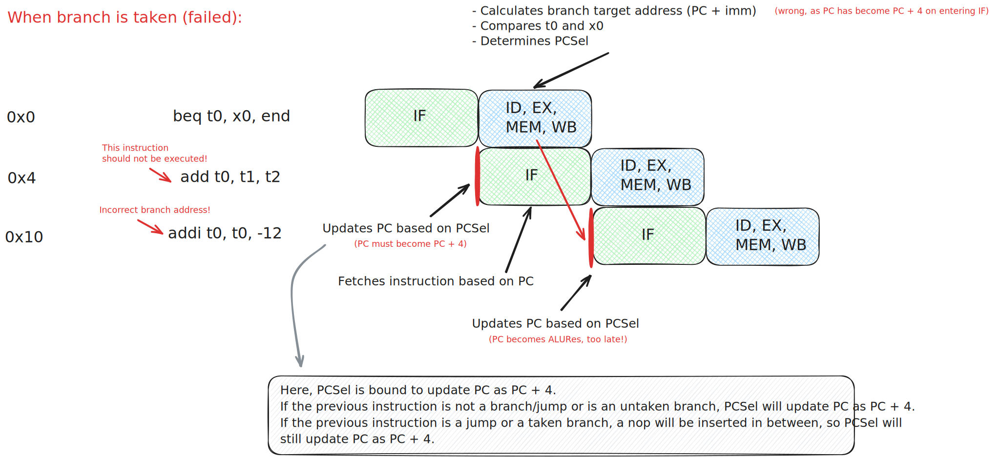

# CS61CPU

## How is the CPU pipelined?

This CPU is two-stage pipelined. 

The first stage handles IF(Instruction Fetch). 

- It reads from IMEM the current instruction according to the PC register.
- It decides, according to `PCSel`, whether to store the currently fetched instruction or `nop` instruction for the second stage.
- It decides, according to `PCSel`, whether to update PC as PC + 4 or as `ALURes`.
- It stores both PC and PC + 4 for the second stage.

The second stage handles ID, EX, MEM and WB.

## What kinds of hazards exist in this CPU?

1. ***No* structural hazards.** Structural hazards occur when multiple instructions cannot be executed in the same clock cycle due to hardware limitations. For example, if we had only one memory instead of separate IMEM and DMEM, reading instructions and storing data into the memory at the same time would be impossible, leading to a structural hazard. But for our CPU such problems do not exist.
2. ***No* data hazards.** Data hazards occur when the output of instruction A is an input of subsequent instruction B, but by the time B receives its inputs, A has not finished execution and the needed data has not been updated. For example, for a five-stage pipelined CPU, `add t0, t1, t2` followed by `sub t3, t0, x0` may lead to a data hazard, since the output of `add` has not been written back to the register t0 by the time `sub` enters execution stage. However, since our CPU is two-stage pipelined, with the second stage encompassing ID, EX, MEM and WB phases, the process of execution and writing back is done in one cycle for one instruction after another. Therefore, no data hazards occur. 
3. **Control hazards.** Control hazards occur when the current PC, which determines what instruction to fetch in the IF stage, is controlled by the output of a previous instruction. For example, `beq t0, x0, label` leads to a control hazard because what PC should become and what instruction to fetch next is based on whether the branch is taken, which cannot be determined until the second stage is finished. This is the only kind of hazard that we have to deal with in our CPU.

## How to resolve control hazards?

Consider the following instructions that contain a branch:

The picture below shows how the branch instruction could go wrong:

- First, calculation of branch target address is incorrect: we should have jumped to `0xc` but in reality we jumped an extra 4 bytes forward to `0x10`. This is because we simply used the current PC added with the immediate, but PC had been updated on entering the new IF stage but we needed the old PC value.
- Second, `PCSel` is always set to update PC as PC + 4, which means `add t0, t1, t2` will always be fetched and executed. This should not happen as we want to jump straight to the target address and ignore the `add`.

To solve this, we:

- Add a register in IF to store the PC for the second stage in order for the branch target address to be calculated correctly.
- Add a multiplexer for `PCSel` in IF to choose which instruction to send to the second stage. If the branch is taken, we let the fetched instruction to go to the second stage; otherwise, we let a `nop` replace it before entering the second stage.

After our modification, this is what the pipeline looks like when a branch is taken:

This is what the pipeline looks like when a branch is not taken:

The corrected IF stage is shown in the image below:

